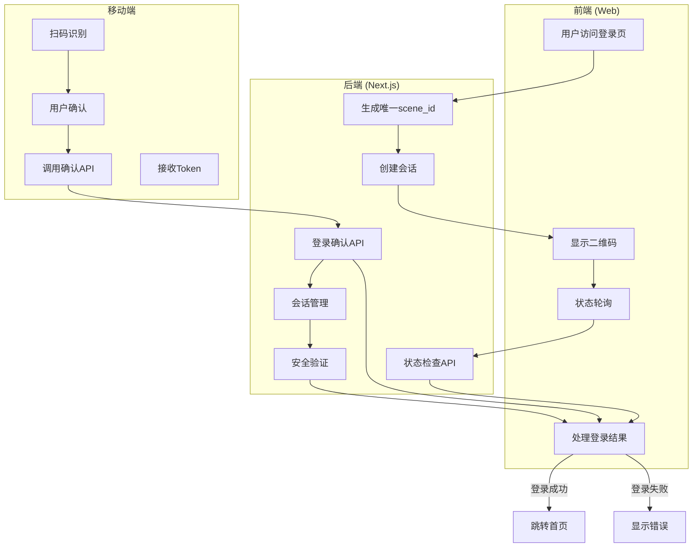
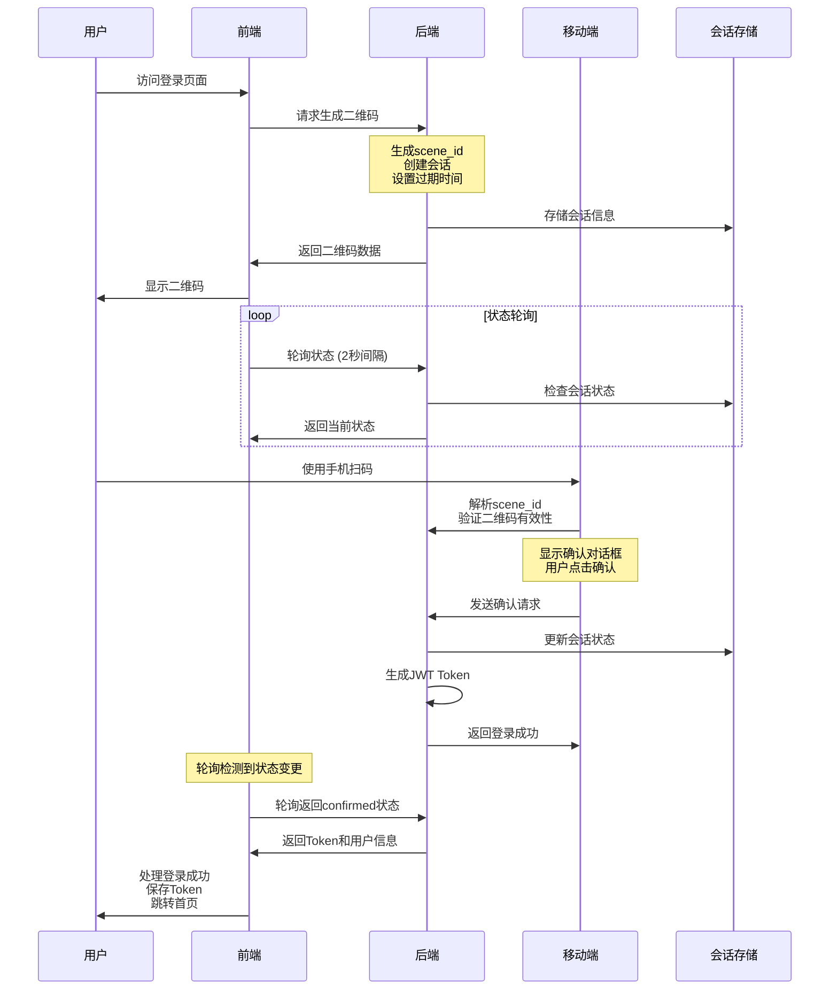
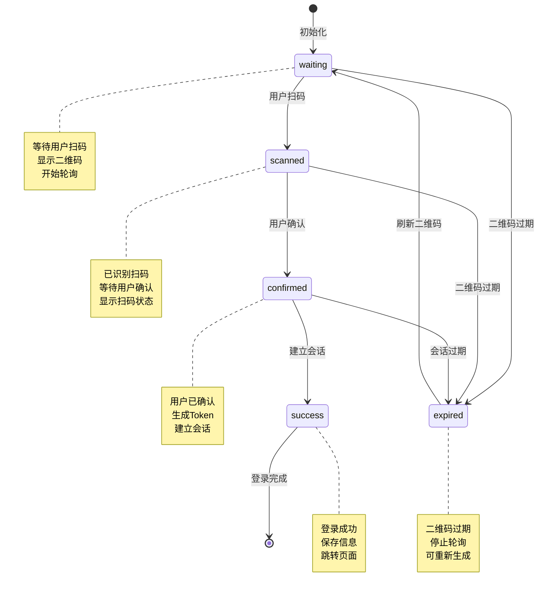

# 扫码登录功能实现方案

## 🎯 需求分析

### 核心功能
1. **二维码生成** (P0) - 生成登录二维码
2. **状态轮询** (P0) - 实时检查扫码状态
3. **扫码确认** (P0) - 移动端扫码确认登录
4. **登录状态同步** (P0) - 前后端状态同步
5. **二维码刷新** (P1) - 二维码过期自动刷新
6. **多设备管理** (P1) - 查看和管理已登录设备

### 技术要求
- **安全性**: 防止二维码被截屏重放
- **实时性**: 快速响应扫码状态
- **可靠性**: 网络中断后自动恢复
- **用户体验**: 流畅的扫码登录流程

### 使用场景
- **桌面端登录**: 用户在电脑浏览器前使用手机扫码登录
- **平板端登录**: 支持平板设备的扫码登录
- **公共设备**: 公共电脑上的安全登录方式
- **多设备同步**: 同一账号在多设备间的快速切换

## 🔄 流程图

### 1. 整体架构流程图



### 2. 详细执行流程图



### 3. 状态机流程图



### 4. API接口流程图

```mermaid
graph LR
    subgraph "API接口流程"
        A[生成二维码] -->|POST| B[/api/login/generate]
        B --> C[生成scene_id]
        C --> D[创建会话]
        D --> E[返回二维码数据]

        F[状态轮询] -->|POST| G[/api/login/status]
        G --> H[检查会话状态]
        H --> I[返回当前状态]

        J[扫码确认] -->|POST| K[/api/login/confirm]
        K --> L[验证会话]
        L --> M[生成Token]
        M --> N[更新会话状态]
        N --> O[返回登录结果]

        P[扫码处理] -->|POST| Q[/api/login/scan]
        Q --> R[验证scene_id]
        R --> S[更新为已扫描]
        S --> T[返回扫描结果]
    end

    subgraph "状态数据流"
        U[waiting] --> V[scanned]
        V --> W[confirmed]
        W --> X[success]
        U --> Y[expired]
    end

    E --> F
    I --> F
    O --> F
    T --> F
```

## 📋 技术方案设计

### 1. 整体架构

```
前端 (Web)                    后端 (Next.js)                    移动端
├─ 二维码显示                ├─ 生成二维码                      ├─ 扫码识别
├─ 状态轮询                  ├─ 状态检查                        ├─ 登录确认
├─ 登录结果展示              ├─ 会话管理                        └─ Token返回
└─ 设备管理                  └─ 安全验证
```

### 2. 核心流程

```
1. 用户访问登录页
   ↓
2. 后端生成唯一scene_id和二维码
   ↓
3. 前端显示二维码并开始轮询
   ↓
4. 用户用手机扫码
   ↓
5. 手机端确认登录
   ↓
6. 后端验证并建立会话
   ↓
7. 前端收到登录成功，跳转
```

### 3. 状态机设计

```
waiting (初始状态)
    ↓ 用户扫码
scanned (已扫码)
    ↓ 用户确认
confirmed (已确认)
    ↓ 建立会话
success (登录成功)
    ↓ 二维码过期
expired (已过期)
```

## 🔧 技术实现方案

### 1. 二维码生成方案

#### 使用qrcode库
```typescript
// src/lib/qrcode.ts
import QRCode from 'qrcode';

export interface QRCodePayload {
  sceneId: string;
  timestamp: number;
  nonce: string;
  signature?: string;
}

export async function generateLoginQRCode(): Promise<{
  sceneId: string;
  qrCodeUrl: string;
  expiresAt: number;
}> {
  const sceneId = generateSceneId();
  const timestamp = Date.now();
  const nonce = generateNonce();
  const expiresAt = timestamp + 1800000; // 30分钟过期

  const payload: QRCodePayload = {
    sceneId,
    timestamp,
    nonce,
  };

  // 添加签名防止篡改
  const signature = generateSignature(payload);
  payload.signature = signature;

  // 生成二维码内容URL
  const qrContent = `${process.env.NEXT_PUBLIC_APP_URL}/login/scan?scene=${sceneId}&t=${timestamp}&n=${nonce}&s=${signature}`;

  // 生成二维码图片
  const qrCodeUrl = await QRCode.toDataURL(qrContent, {
    width: 200,
    margin: 2,
    color: {
      dark: '#000000',
      light: '#FFFFFF',
    },
  });

  return {
    sceneId,
    qrCodeUrl,
    expiresAt,
  };
}

// 生成数字签名
const generateSignature = (payload: Omit<QRCodePayload, 'signature'>): string => {
  const data = `${payload.sceneId}:${payload.timestamp}:${payload.nonce}`;
  const crypto = require('crypto');
  return crypto
    .createHmac('sha256', process.env.QR_CODE_SECRET!)
    .update(data)
    .digest('hex');
};
```

### 2. 状态轮询机制

#### WebSocket实时通信（推荐）
```typescript
// src/lib/websocket.ts
export class LoginWebSocket {
  private ws: WebSocket | null = null;
  private reconnectAttempts = 0;
  private maxReconnectAttempts = 5;
  private reconnectDelay = 1000;
  private eventHandlers: Map<string, Function[]> = new Map();

  connect(sceneId: string) {
    const wsUrl = `${process.env.NEXT_PUBLIC_WS_URL}/login/${sceneId}`;
    this.ws = new WebSocket(wsUrl);

    this.ws.onopen = () => {
      console.log('WebSocket connected');
      this.reconnectAttempts = 0;
    };

    this.ws.onmessage = (event) => {
      try {
        const data = JSON.parse(event.data);
        this.handleMessage(data);
      } catch (error) {
        console.error('WebSocket message parsing error:', error);
      }
    };

    this.ws.onclose = () => {
      console.log('WebSocket disconnected');
      this.reconnect(sceneId);
    };

    this.ws.onerror = (error) => {
      console.error('WebSocket error:', error);
    };
  }

  private reconnect(sceneId: string) {
    if (this.reconnectAttempts < this.maxReconnectAttempts) {
      this.reconnectAttempts++;
      console.log(`Reconnecting attempt ${this.reconnectAttempts}/${this.maxReconnectAttempts}`);

      setTimeout(() => {
        this.connect(sceneId);
      }, this.reconnectDelay * Math.pow(2, this.reconnectAttempts - 1)); // 指数退避
    } else {
      this.emit('connection_failed', { sceneId, message: '重连失败，请刷新页面' });
    }
  }

  private handleMessage(data: any) {
    switch (data.type) {
      case 'scan_success':
        this.emit('scan_success', data);
        break;
      case 'login_success':
        this.emit('login_success', data);
        break;
      case 'qr_expired':
        this.emit('qr_expired', data);
        break;
      case 'error':
        this.emit('error', data);
        break;
    }
  }

  on(event: string, handler: Function) {
    if (!this.eventHandlers.has(event)) {
      this.eventHandlers.set(event, []);
    }
    this.eventHandlers.get(event)!.push(handler);
  }

  private emit(event: string, data: any) {
    const handlers = this.eventHandlers.get(event);
    if (handlers) {
      handlers.forEach(handler => handler(data));
    }
  }

  disconnect() {
    if (this.ws) {
      this.ws.close();
      this.ws = null;
    }
  }
}
```

#### HTTP轮询备用方案
```typescript
// src/app/api/login/status/route.ts
export async function POST(request: Request) {
  const { sceneId } = await request.json();

  try {
    // 检查登录状态
    const status = await checkLoginStatus(sceneId);

    return Response.json({
      success: true,
      status: status.state, // 'waiting' | 'scanned' | 'confirmed' | 'expired'
      userInfo: status.userInfo || null,
      deviceInfo: status.deviceInfo || null,
      timestamp: Date.now(),
    });
  } catch (error) {
    return Response.json({
      success: false,
      message: '状态检查失败',
    }, { status: 500 });
  }
}

// 优化的轮询客户端
export class LoginPoller {
  private pollInterval: NodeJS.Timeout | null = null;
  private isPolling = false;

  constructor(
    private sceneId: string,
    private onStatusChange: (status: any) => void,
    private onError: (error: any) => void
  ) {}

  start() {
    if (this.isPolling) return;

    this.isPolling = true;
    this.poll();

    // 每2秒轮询一次
    this.pollInterval = setInterval(() => {
      this.poll();
    }, 2000);
  }

  private async poll() {
    try {
      const response = await fetch('/api/login/status', {
        method: 'POST',
        headers: {
          'Content-Type': 'application/json',
        },
        body: JSON.stringify({ sceneId: this.sceneId }),
      });

      const data = await response.json();

      if (data.success) {
        this.onStatusChange(data);

        // 如果登录成功或过期，停止轮询
        if (data.status === 'confirmed' || data.status === 'expired') {
          this.stop();
        }
      } else {
        this.onError(data);
      }
    } catch (error) {
      this.onError({ message: '网络错误', error });
    }
  }

  stop() {
    if (this.pollInterval) {
      clearInterval(this.pollInterval);
      this.pollInterval = null;
    }
    this.isPolling = false;
  }
}
```

### 3. 移动端扫码处理

#### 扫码确认API
```typescript
// src/app/api/login/confirm/route.ts
export async function POST(request: Request) {
  const { sceneId, userId, deviceInfo } = await request.json();

  // 验证sceneId有效性
  const session = await getLoginSession(sceneId);
  if (!session || session.isExpired()) {
    return Response.json({
      success: false,
      message: '二维码已过期',
    });
  }

  // 生成登录token
  const token = generateAuthToken(userId, deviceInfo);

  // 更新登录状态
  await updateLoginStatus(sceneId, {
    state: 'confirmed',
    userId,
    token,
    deviceInfo,
  });

  return Response.json({
    success: true,
    token,
    userInfo: await getUserInfo(userId),
  });
}
```

### 4. 会话管理

#### 登录会话存储
```typescript
// src/lib/session.ts
export interface LoginSession {
  sceneId: string;
  state: 'waiting' | 'scanned' | 'confirmed' | 'expired';
  userId?: string;
  token?: string;
  deviceInfo?: DeviceInfo;
  createdAt: number;
  expiresAt: number;
  scannedAt?: number;
  confirmedAt?: number;
  ipAddress?: string;
  userAgent?: string;
}

class SessionManager {
  private sessions = new Map<string, LoginSession>();
  private cleanupInterval: NodeJS.Timeout | null = null;

  constructor() {
    this.startCleanup();
  }

  createSession(sceneId: string, request?: Request): LoginSession {
    const session: LoginSession = {
      sceneId,
      state: 'waiting',
      createdAt: Date.now(),
      expiresAt: Date.now() + 1800000, // 30分钟
      ipAddress: this.getClientIP(request),
      userAgent: request?.headers.get('user-agent') || undefined,
    };

    this.sessions.set(sceneId, session);
    return session;
  }

  updateSession(sceneId: string, updates: Partial<LoginSession>): boolean {
    const session = this.sessions.get(sceneId);
    if (!session) return false;

    Object.assign(session, updates);

    // 状态变更时记录时间戳
    if (updates.state === 'scanned' && !session.scannedAt) {
      session.scannedAt = Date.now();
    }
    if (updates.state === 'confirmed' && !session.confirmedAt) {
      session.confirmedAt = Date.now();
    }

    return true;
  }

  getSession(sceneId: string): LoginSession | undefined {
    return this.sessions.get(sceneId);
  }

  isSessionValid(sceneId: string): boolean {
    const session = this.sessions.get(sceneId);
    if (!session) return false;
    return session.expiresAt > Date.now() && session.state !== 'expired';
  }

  // 获取用户的活动会话
  getUserActiveSessions(userId: string): LoginSession[] {
    const now = Date.now();
    return Array.from(this.sessions.values()).filter(session =>
      session.userId === userId &&
      session.expiresAt > now &&
      session.state === 'confirmed'
    );
  }

  // 终止用户的所有会话
  terminateUserSessions(userId: string): number {
    let terminatedCount = 0;
    for (const [sceneId, session] of this.sessions.entries()) {
      if (session.userId === userId) {
        session.state = 'expired';
        session.expiresAt = Date.now();
        terminatedCount++;
      }
    }
    return terminatedCount;
  }

  private getClientIP(request?: Request): string | undefined {
    if (!request) return undefined;

    // 获取真实IP，考虑代理情况
    return (
      request.headers.get('x-forwarded-for') ||
      request.headers.get('x-real-ip') ||
      request.headers.get('cf-connecting-ip') || // Cloudflare
      undefined
    )?.split(',')[0]?.trim();
  }

  private startCleanup() {
    // 每分钟清理一次过期会话
    this.cleanupInterval = setInterval(() => {
      const now = Date.now();
      const expiredKeys: string[] = [];

      for (const [sceneId, session] of this.sessions.entries()) {
        if (session.expiresAt < now) {
          expiredKeys.push(sceneId);
        }
      }

      expiredKeys.forEach(sceneId => {
        this.sessions.delete(sceneId);
      });

      if (expiredKeys.length > 0) {
        console.log(`Cleaned up ${expiredKeys.length} expired sessions`);
      }
    }, 60000);
  }

  destroy() {
    if (this.cleanupInterval) {
      clearInterval(this.cleanupInterval);
      this.cleanupInterval = null;
    }
    this.sessions.clear();
  }

  // 统计信息
  getStats() {
    const now = Date.now();
    const total = this.sessions.size;
    const active = Array.from(this.sessions.values()).filter(s => s.expiresAt > now).length;
    const expired = total - active;

    return {
      total,
      active,
      expired,
      states: {
        waiting: Array.from(this.sessions.values()).filter(s => s.state === 'waiting').length,
        scanned: Array.from(this.sessions.values()).filter(s => s.state === 'scanned').length,
        confirmed: Array.from(this.sessions.values()).filter(s => s.state === 'confirmed').length,
        expired: Array.from(this.sessions.values()).filter(s => s.state === 'expired').length,
      }
    };
  }
}

// 全局会话管理器实例
export const sessionManager = new SessionManager();
```

## 🎨 前端组件设计

### 1. 扫码登录组件

```typescript
// src/components/auth/QRCodeLogin.tsx
"use client";

import { useState, useEffect } from "react";
import { generateLoginQRCode, pollLoginStatus } from "@/lib/auth";

export default function QRCodeLogin() {
  const [qrCodeUrl, setQrCodeUrl] = useState<string>("");
  const [sceneId, setSceneId] = useState<string>("");
  const [status, setStatus] = useState<"waiting" | "scanned" | "confirmed" | "expired">("waiting");
  const [isLoading, setIsLoading] = useState(true);

  const initQRCode = async () => {
    try {
      setIsLoading(true);
      const { sceneId, qrCodeUrl, expiresAt } = await generateLoginQRCode();

      setSceneId(sceneId);
      setQrCodeUrl(qrCodeUrl);
      setIsLoading(false);

      // 开始轮询
      startPolling(sceneId);

      // 设置过期定时器
      setTimeout(() => {
        setStatus("expired");
      }, expiresAt - Date.now());
    } catch (error) {
      console.error("生成二维码失败:", error);
      setIsLoading(false);
    }
  };

  const startPolling = async (sceneId: string) => {
    const poll = async () => {
      try {
        const result = await pollLoginStatus(sceneId);
        if (result.success) {
          setStatus(result.status);

          if (result.status === "confirmed") {
            // 登录成功
            handleLoginSuccess(result.token, result.userInfo);
            return;
          }
        }
      } catch (error) {
        console.error("轮询失败:", error);
      }

      // 继续轮询
      if (status !== "expired" && status !== "confirmed") {
        setTimeout(poll, 2000); // 2秒轮询一次
      }
    };

    poll();
  };

  const handleLoginSuccess = (token: string, userInfo: any) => {
    // 保存token和用户信息
    localStorage.setItem("auth_token", token);
    localStorage.setItem("user_info", JSON.stringify(userInfo));

    // 跳转到首页
    window.location.href = "/";
  };

  const refreshQRCode = () => {
    setStatus("waiting");
    initQRCode();
  };

  useEffect(() => {
    initQRCode();
  }, []);

  return (
    <div className="max-w-md mx-auto p-6 bg-white rounded-lg shadow-md">
      <h2 className="text-2xl font-bold text-center mb-6">扫码登录</h2>

      <div className="flex flex-col items-center space-y-4">
        {isLoading ? (
          <div className="w-48 h-48 bg-gray-100 rounded-lg flex items-center justify-center">
            <div className="text-gray-500">加载中...</div>
          </div>
        ) : status === "expired" ? (
          <div className="w-48 h-48 bg-gray-100 rounded-lg flex flex-col items-center justify-center">
            <div className="text-gray-500 mb-2">二维码已过期</div>
            <button
              onClick={refreshQRCode}
              className="px-4 py-2 bg-blue-500 text-white rounded hover:bg-blue-600"
            >
              刷新二维码
            </button>
          </div>
        ) : (
          <div className="relative">
            
            {status === "scanned" && (
              <div className="absolute inset-0 bg-black bg-opacity-50 rounded flex items-center justify-center">
                <div className="text-white text-center">
                  <div className="text-lg">✓</div>
                  <div className="text-sm">已扫码</div>
                </div>
              </div>
            )}
          </div>
        )}

        <div className="text-center text-sm text-gray-600">
          {status === "waiting" && "请使用手机扫描二维码登录"}
          {status === "scanned" && "扫描成功，请在手机上确认登录"}
          {status === "confirmed" && "登录成功，正在跳转..."}
        </div>

        <div className="text-xs text-gray-500">
          二维码有效期30分钟
        </div>
      </div>
    </div>
  );
}
```

### 2. 设备管理组件

```typescript
// src/components/auth/DeviceManager.tsx
export default function DeviceManager() {
  const [devices, setDevices] = useState<DeviceInfo[]>([]);

  const fetchDevices = async () => {
    const response = await fetch("/api/auth/devices");
    const data = await response.json();
    setDevices(data.devices);
  };

  const removeDevice = async (deviceId: string) => {
    await fetch(`/api/auth/devices/${deviceId}`, {
      method: "DELETE",
    });
    fetchDevices();
  };

  useEffect(() => {
    fetchDevices();
  }, []);

  return (
    <div className="space-y-4">
      <h3 className="text-lg font-semibold">已登录设备</h3>
      {devices.map((device) => (
        <div key={device.id} className="flex items-center justify-between p-3 border rounded">
          <div>
            <div className="font-medium">{device.name}</div>
            <div className="text-sm text-gray-500">{device.lastActive}</div>
          </div>
          <button
            onClick={() => removeDevice(device.id)}
            className="text-red-500 hover:text-red-700"
          >
            移除
          </button>
        </div>
      ))}
    </div>
  );
}
```

## 🔒 安全性考虑

### 1. 防重放攻击
```typescript
// 生成带时间戳和随机数的sceneId
const generateSceneId = (): string => {
  const timestamp = Date.now();
  const random = crypto.getRandomValues(new Uint8Array(8)).join('');
  return `${timestamp}-${random}`;
};

// 验证sceneId时效性
const validateSceneId = (sceneId: string): boolean => {
  try {
    const timestamp = parseInt(sceneId.split('-')[0]);
    const now = Date.now();
    const isValid = (now - timestamp) < 1800000; // 30分钟内有效
    return isValid && !isNaN(timestamp);
  } catch {
    return false;
  }
};

// 验证二维码签名
const validateQRCodeSignature = (payload: QRCodePayload): boolean => {
  const { sceneId, timestamp, nonce, signature } = payload;
  if (!signature) return false;

  const expectedSignature = generateSignature({ sceneId, timestamp, nonce });
  return signature === expectedSignature;
};
```

### 2. Token安全
```typescript
// 生成安全的JWT token
const generateAuthToken = (userId: string, deviceInfo: DeviceInfo): string => {
  const payload = {
    userId,
    deviceId: deviceInfo.id,
    iat: Math.floor(Date.now() / 1000), // 使用秒级时间戳
    exp: Math.floor(Date.now() / 1000) + (7 * 24 * 60 * 60), // 7天过期
    jti: generateNonce(), // JWT ID，防止重放
  };

  return jwt.sign(payload, process.env.JWT_SECRET!, {
    algorithm: 'HS256',
    expiresIn: '7d',
  });
};

// 验证JWT token
const verifyAuthToken = (token: string): any => {
  try {
    return jwt.verify(token, process.env.JWT_SECRET!, {
      algorithms: ['HS256'],
      clockTolerance: 30, // 30秒时钟容差
    });
  } catch (error) {
    throw new Error('Invalid token');
  }
};
```

### 3. 设备指纹与安全检测
```typescript
// 收集设备信息
const collectDeviceInfo = (): DeviceInfo => {
  const fingerprint = generateDeviceFingerprint();

  return {
    id: fingerprint,
    name: `${getPlatformInfo()} - ${getBrowserInfo()}`,
    userAgent: navigator.userAgent,
    platform: navigator.platform,
    screenResolution: `${screen.width}x${screen.height}`,
    colorDepth: screen.colorDepth,
    timezone: Intl.DateTimeFormat().resolvedOptions().timeZone,
    language: navigator.language,
    isMobile: /Mobile|Android|iPhone|iPad|iPod/i.test(navigator.userAgent),
    isBot: detectBot(),
  };
};

// 生成设备指纹
const generateDeviceFingerprint = (): string => {
  const components = [
    navigator.userAgent,
    navigator.platform,
    navigator.language,
    screen.width,
    screen.height,
    screen.colorDepth,
    new Date().getTimezoneOffset(),
    navigator.hardwareConcurrency,
    navigator.deviceMemory,
  ];

  const fingerprint = components.join('|');
  return crypto.subtle.digest('SHA-256', new TextEncoder().encode(fingerprint))
    .then(hash => {
      const hashArray = Array.from(new Uint8Array(hash));
      return hashArray.map(b => b.toString(16).padStart(2, '0')).join('');
    });
};

// 简单的机器人检测
const detectBot = (): boolean => {
  const botPatterns = [
    /bot/i, /crawler/i, /spider/i, /scraper/i,
    /curl/i, /wget/i, /postman/i, /insomnia/i,
  ];

  return botPatterns.some(pattern => pattern.test(navigator.userAgent));
};

// 获取平台信息
const getPlatformInfo = (): string => {
  const userAgent = navigator.userAgent;
  if (userAgent.includes('Windows')) return 'Windows';
  if (userAgent.includes('Mac')) return 'macOS';
  if (userAgent.includes('Linux')) return 'Linux';
  if (userAgent.includes('Android')) return 'Android';
  if (userAgent.includes('iPhone') || userAgent.includes('iPad')) return 'iOS';
  return 'Unknown';
};

// 获取浏览器信息
const getBrowserInfo = (): string => {
  const userAgent = navigator.userAgent;
  if (userAgent.includes('Chrome')) return 'Chrome';
  if (userAgent.includes('Firefox')) return 'Firefox';
  if (userAgent.includes('Safari')) return 'Safari';
  if (userAgent.includes('Edge')) return 'Edge';
  return 'Unknown';
};
```

### 4. 频率限制与异常检测
```typescript
// 频率限制器
class RateLimiter {
  private attempts = new Map<string, { count: number; resetTime: number }>();

  isAllowed(key: string, maxAttempts: number, windowMs: number): boolean {
    const now = Date.now();
    const record = this.attempts.get(key);

    if (!record || now > record.resetTime) {
      // 新记录或已重置
      this.attempts.set(key, {
        count: 1,
        resetTime: now + windowMs,
      });
      return true;
    }

    if (record.count >= maxAttempts) {
      return false; // 超出限制
    }

    record.count++;
    return true;
  }

  getRemainingAttempts(key: string, maxAttempts: number): number {
    const record = this.attempts.get(key);
    if (!record) return maxAttempts;
    return Math.max(0, maxAttempts - record.count);
  }
}

// 异常行为检测
const detectSuspiciousActivity = (request: Request): boolean => {
  const userAgent = request.headers.get('user-agent');
  const ip = getClientIP(request);

  // 检测异常User-Agent
  if (!userAgent || userAgent.length < 10) {
    return true;
  }

  // 检测异常IP（示例）
  const suspiciousIPs = new Set([
    // 添加可疑IP列表
  ]);

  if (ip && suspiciousIPs.has(ip)) {
    return true;
  }

  return false;
};
```

## 📱 移动端集成

### 1. 扫码SDK集成
```typescript
// 移动端扫码处理
const handleQRCodeScan = async (qrContent: string) => {
  try {
    const url = new URL(qrContent);
    const sceneId = url.searchParams.get('scene');
    const timestamp = url.searchParams.get('t');
    const nonce = url.searchParams.get('n');

    // 验证二维码有效性
    if (!sceneId || !timestamp || !nonce) {
      throw new Error('无效的二维码');
    }

    // 显示确认对话框
    const confirmed = await showConfirmDialog({
      title: '确认登录',
      message: '是否允许在当前设备上登录？',
    });

    if (confirmed) {
      await confirmLogin(sceneId);
    }
  } catch (error) {
    console.error('扫码处理失败:', error);
  }
};
```

### 2. 登录确认API调用
```typescript
const confirmLogin = async (sceneId: string) => {
  const deviceInfo = await collectDeviceInfo();
  const userInfo = await getCurrentUser();

  const response = await fetch('/api/login/confirm', {
    method: 'POST',
    headers: {
      'Content-Type': 'application/json',
      'Authorization': `Bearer ${userInfo.token}`,
    },
    body: JSON.stringify({
      sceneId,
      userId: userInfo.id,
      deviceInfo,
    }),
  });

  const result = await response.json();
  if (result.success) {
    showSuccessMessage('登录成功');
  }
};
```

## 🚀 实施计划

### 阶段一：核心功能（1周）
1. **二维码生成与显示** - 基础二维码生成和显示
2. **HTTP轮询机制** - 状态检查和轮询客户端
3. **登录确认流程** - 基础的扫码确认和token生成
4. **会话管理** - 基础会话存储和状态管理

#### 交付物
- ✅ 二维码生成API
- ✅ 状态轮询API
- ✅ 登录确认API
- ✅ 基础前端组件
- ✅ 会话管理器

### 阶段二：完整功能（1周）
1. **WebSocket实时通信** - 实时状态推送和重连机制
2. **设备管理系统** - 已登录设备查看和管理
3. **安全增强** - 防重放攻击、Token安全、设备指纹
4. **错误处理与恢复** - 完善的错误处理和自动恢复

#### 交付物
- ✅ WebSocket服务端
- ✅ WebSocket客户端
- ✅ 设备管理API
- ✅ 设备管理组件
- ✅ 安全验证机制

### 阶段三：优化完善（1周）
1. **性能优化** - 内存管理、连接池、缓存策略
2. **用户体验优化** - 状态提示、动画效果、响应式设计
3. **监控与日志** - 登录行为监控、异常检测
4. **测试与文档** - 单元测试、集成测试、技术文档

#### 交付物
- ✅ 性能监控面板
- ✅ 错误日志系统
- ✅ 测试用例和报告
- ✅ 用户使用文档
- ✅ API文档

## 📋 技术选型

### 核心依赖
- **qrcode**: 二维码生成（成熟稳定）
- **jsonwebtoken**: JWT token生成（行业标准）
- **ws**: WebSocket服务端（高性能）
- **@types/qrcode**: TypeScript类型定义

### 备选方案评估
- **通信方式**: WebSocket（推荐）vs HTTP轮询（备用）
- **存储方案**: 内存存储（开发）vs Redis（生产）
- **二维码库**: qrcode（推荐）vs qr.js（轻量级）

### 扩展性考虑
- **水平扩展**: 支持多实例部署
- **存储扩展**: 支持Redis集群
- **监控集成**: 支持APM工具集成

## 📊 预期效果与技术指标

### 性能指标
- **二维码生成时间**: < 300ms
- **状态响应时间**: < 100ms（WebSocket）/< 2s（HTTP轮询）
- **登录成功率**: > 99.5%
- **并发支持**: 5000+ 同时扫码
- **内存占用**: < 100MB（1000并发）

### 可用性指标
- **系统可用性**: > 99.9%
- **故障恢复时间**: < 30秒
- **数据一致性**: 100%
- **错误率**: < 0.1%

### 用户体验
- **扫码到登录**: < 5秒
- **状态实时性**: < 1秒延迟（WebSocket）
- **二维码刷新**: 自动过期刷新
- **多设备支持**: 同时10台设备

### 安全指标
- **防重放攻击**: 100%有效
- **Token安全**: 符合JWT最佳实践
- **数据加密**: 传输层加密
- **异常检测**: > 95%准确率

## 🔧 环境配置

### 开发环境
```bash
# 安装依赖
npm install qrcode jsonwebtoken ws @types/qrcode

# 环境变量
NEXT_PUBLIC_APP_URL=http://localhost:3002
NEXT_PUBLIC_WS_URL=ws://localhost:3002
JWT_SECRET=your-secret-key
```

### 生产环境
```bash
# 环境变量
NEXT_PUBLIC_APP_URL=https://your-domain.com
NEXT_PUBLIC_WS_URL=wss://your-domain.com
JWT_SECRET=your-production-secret
REDIS_URL=your-redis-url
```

## 📝 测试计划

### 单元测试
- 二维码生成功能
- 状态轮询逻辑
- 会话管理功能
- 安全验证逻辑

### 集成测试
- 完整登录流程
- WebSocket连接
- 设备管理功能
- 错误场景处理

### 性能测试
- 并发扫码测试
- 长时间运行测试
- 内存泄漏测试
- 网络中断恢复测试

---

## 🎯 总结

扫码登录功能将大幅提升用户体验，特别是在移动设备普及的今天。通过分阶段实施，可以在保证质量的同时快速交付核心功能。该方案兼顾了安全性、实时性和用户体验，为后续功能扩展奠定了良好基础。