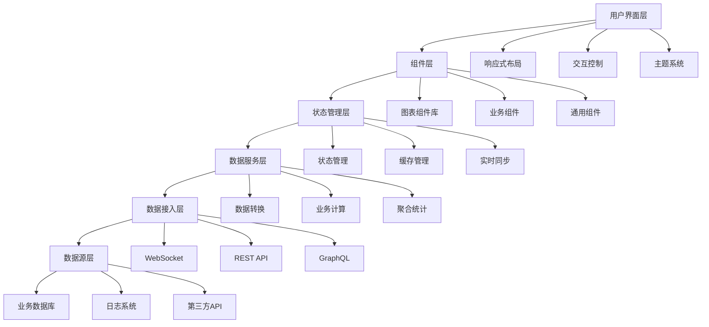

# React Scenario Lab - 企业级数据可视化大屏架构指南

## 🎯 概述：解决数据可视化技术挑战
企业级数据可视化面临**海量数据渲染**、**实时数据更新**、**复杂交互设计**等技术挑战。本架构通过**Canvas虚拟化**、**流式数据处理**、**组件化图表**等核心技术，实现**毫秒级数据响应**和**流畅交互体验**。解决传统大屏系统中常见的**性能卡顿**、**数据延迟**、**扩展性差**等痛点，为企业打造**高性能**、**可扩展**、**易维护**的数据可视化平台。

### 核心技术挑战
- **大规模数据渲染**：10万+数据点的实时渲染和交互性能优化
- **多数据源整合**：异构数据源的标准化接入和实时同步
- **大屏适配方案**：4K/8K分辨率和多屏幕拼接的适配优化
- **实时数据处理**：高频数据流的处理、缓存和更新策略

## 🎯 项目价值主张
- **业务痛点**: 企业决策者需要实时、直观的业务数据监控，传统报表系统存在数据滞后、展示单一、交互性差等问题
- **用户价值**: 提供一站式数据监控平台，支持实时数据更新、多维度分析、智能预警，提升决策效率 60%+
- **技术影响力**: 建立企业级数据可视化技术标准，沉淀可复用的可视化组件库和最佳实践
- **成功指标**: 首屏加载 < 3s，数据刷新延迟 < 500ms，用户满意度 ≥ 90%，系统可用性 ≥ 99.9%

## 🏗️ 架构设计原则
- **可扩展性**: 支持水平扩展，可接入 10+ 数据源，支持 100+ 并发用户
- **可维护性**: 模块化设计，组件复用率 ≥ 80%，代码可读性评分 ≥ 8.0/10
- **性能基准**: 4K分辨率流畅渲染，内存使用 < 500MB，CPU使用率 < 30%
- **安全标准**: 数据传输加密，权限控制，SQL注入防护，XSS防护

## 📊 技术架构图

## 🚀 核心功能模块

### P0 - 核心功能 (MVP)
- [ ] **实时数据接入** - 建立WebSocket长连接，支持毫秒级数据推送 | High | 2周
  *技术要点：*
  - WebSocket连接池和心跳保活机制
  - 数据流处理和实时计算引擎
  - 多数据源适配器和统一数据格式
  - 断线重连和数据缓存策略

- [ ] **多图表渲染引擎** - 基于ECharts/antV的高性能图表渲染 | High | 3周
  *技术要点：*
  - Canvas虚拟化和视口裁剪优化
  - 图表组件抽象和标准化接口
  - 动画性能优化和硬件加速
  - 大数据量渲染的分片和懒加载

- [ ] **响应式布局系统** - 支持4K/8K分辨率和多屏幕拼接 | Medium | 2周
  *技术要点：*
  - CSS Grid和Flexbox的自适应布局
  - 视口检测和DPI适配算法
  - 大屏拼接的坐标同步机制
  - 移动端响应式和触摸交互

- [ ] **主题切换系统** - 支持明暗主题和自定义品牌色 | Low | 1周
  *技术要点：*
  - CSS变量和动态主题切换
  - 品牌色系统和色彩算法
  - 主题配置和实时预览
  - 无障碍访问和对比度优化

### P1 - 重要功能
- [ ] **数据钻取分析** - 支持下钻、上卷、多维度切换 | Medium | 2周
- [ ] **智能预警系统** - 基于阈值的自动告警和通知 | Medium | 2周
- [ ] **权限管理系统** - 基于RBAC的细粒度权限控制 | High | 2周
- [ ] **数据导出功能** - 支持Excel/PDF/图片格式导出 | Low | 1周

### P2 - 增强功能
- [ ] **AI辅助分析** - 基于机器学习的异常检测和趋势预测 | High | 4周
- [ ] **协作功能** - 多用户实时协作和评论系统 | Medium | 3周
- [ ] **移动端适配** - 响应式设计支持移动设备访问 | Medium | 2周

## 🎯 技术攻坚点

### 架构级挑战
- [ ] **大规模数据渲染优化** - 10万+数据点的实时渲染性能优化 | Canvas虚拟化 + 数据分片 + GPU加速 | 高风险
- [ ] **多数据源统一接入** - 异构数据源的标准化接入和实时同步 | 数据适配器模式 + 消息队列 + 事件驱动 | 中风险
- [ ] **内存泄漏防控** - 长时间运行的内存稳定性保障 | WeakMap + 自动清理 + 内存监控 | 低风险

### 性能优化挑战
- [ ] **首屏加载优化** - 复杂图表的快速首屏渲染 | 懒加载 + 骨架屏 + 预渲染 | 首屏时间 < 3s
- [ ] **实时数据更新优化** - 高频数据更新的流畅性 | 数据diff + 增量更新 + requestAnimationFrame | 刷新延迟 < 500ms
- [ ] **大屏拼接同步** - 多屏幕间的状态同步 | 状态广播 + 时间戳同步 | 延迟 < 100ms

### 工程化挑战
- [ ] **组件库标准化** - 企业级图表组件库的建设和维护 | Storybook + 自动化测试 + 版本管理 | 提升开发效率 50%
- [ ] **监控体系建设** - 完整的性能监控和错误追踪体系 | 自埋点 + 第三方监控 + 实时告警 | 问题定位时间 < 10min

## 🔧 技术实现方案

### 核心技术栈
- **框架选择**: Next.js 15 + React 19 - 服务端渲染优化SEO，客户端组件提升交互性，对比Vite：更好的生产优化和生态
  *技术要点：*
  - App Router和服务端组件(SSC)
  - 并发渲染和Suspense边界
  - 增量静态生成(ISG)和客户端导航
  - 图片优化和字体加载策略

- **状态管理**: Zustand + React Query - Zustand轻量级状态管理，React Query处理服务端状态缓存和同步
  *技术要点：*
  - 原子化状态和订阅机制
  - 服务端状态缓存和同步策略
  - 乐观更新和错误处理
  - 无限滚动和分页加载

- **样式方案**: Tailwind CSS 4 + CSS-in-JS - 原子化CSS提升开发效率，CSS-in-JS处理动态主题
  *技术要点：*
  - 原子化CSS和组件封装
  - 动态主题和CSS变量
  - 响应式设计和媒体查询
  - CSS-in-JS的运行时优化

- **构建工具**: Turbopack + SWC - 极致的构建性能，Rust编译器提升编译速度
  *技术要点：*
  - 增量构建和并行编译
  - TypeScript和JSX处理
  - 代码分割和Tree Shaking
  - 热更新和开发服务器

### 关键技术模块

#### 模块1: 数据可视化引擎
- **设计模式**: 策略模式 + 工厂模式 - 支持多种图表类型的统一接口
- **核心算法**: 数据聚合算法 O(n log n) - 大数据集的高效聚合计算
- **性能考量**: Canvas虚拟化 - 只渲染可视区域，支持百万级数据点
- **扩展性设计**: 插件化架构 - 支持自定义图表类型和交互行为
- **测试策略**: 单元测试 + 视觉回归测试 - 确保图表渲染一致性

#### 模块2: 实时数据管理
- **设计模式**: 观察者模式 + 代理模式 - 数据变化自动通知，支持数据缓存
- **核心算法**: 数据diff算法 O(n) - 高效计算数据变化，减少不必要的重渲染
- **性能考量**: 内存池管理 - 复用数据对象，减少GC压力
- **扩展性设计**: 适配器模式 - 支持多种数据源的统一接入
- **测试策略**: 压力测试 + 并发测试 - 验证高并发场景下的稳定性

#### 模块3: 响应式布局系统
- **设计模式**: 组合模式 + 装饰器模式 - 灵活的布局组合和装饰
- **核心算法**: 网格布局算法 O(m*n) - 自适应网格计算
- **性能考量**: CSS Grid + Flexbox - 硬件加速的布局渲染
- **扩展性设计**: 插件化布局器 - 支持自定义布局算法
- **测试策略**: 多分辨率测试 + 跨浏览器测试 - 确保兼容性

## 📈 性能指标体系

### 核心性能指标
- **加载性能**: LCP < 2.5s, FCP < 1.8s, TTI < 3.8s
- **交互性能**: FID < 100ms, CLS < 0.1
- **运行时性能**: 内存使用 < 500MB, CPU使用率 < 30%
- **业务指标**: 数据刷新延迟 < 500ms, 用户操作响应 < 200ms

### 监控体系
- **实时监控**: Sentry + 自研性能监控平台，关键指标异常自动告警
- **性能回归**: Lighthouse CI + WebPageTest，自动化性能回归检测
- **用户体验**: 用户行为分析 + 性能体验评分，持续优化用户体验

## 🛡️ 质量保障体系

### 代码质量
- **代码规范**: ESLint + Prettier + TypeScript严格模式，代码审查至少2人
- **测试覆盖率**: 单元测试 ≥ 80%, 集成测试 ≥ 60%, E2E测试覆盖核心流程
- **类型安全**: TypeScript strict模式，杜绝any类型使用

### 可靠性保障
- **错误边界**: React Error Boundary + 全局错误捕获，优雅降级处理
- **降级方案**: WebSocket断线自动重连 + 数据本地缓存，离线可用
- **数据一致性**: 乐观更新 + 服务端校验，确保数据一致性

## 📋 实施路线图

### Phase 1: 基础架构搭建 (4周)
- [ ] 技术栈选型和环境搭建
- [ ] 核心组件库开发
- [ ] 数据接入层设计
- [ ] CI/CD流水线建设
- **交付物**: 可运行的基础架构，核心组件库文档

### Phase 2: 核心功能开发 (6周)
- [ ] 实时数据接入和渲染
- [ ] 图表组件开发
- [ ] 响应式布局系统
- [ ] 基础交互功能
- **交付物**: MVP版本，支持基础数据展示和交互

### Phase 3: 功能完善优化 (4周)
- [ ] 性能优化和测试
- [ ] 权限管理和安全加固
- [ ] 监控体系完善
- [ ] 文档和培训材料
- **交付物**: 生产就绪的完整系统

## 🎓 技术沉淀计划

### 文档体系
- **架构文档**: 系统架构图 + 技术选型决策 + 设计模式应用
- **API文档**: 完整的接口文档 + 使用示例 + 最佳实践
- **最佳实践**: 性能优化指南 + 错误处理规范 + 代码组织模式

### 知识分享
- **技术分享**: 每月2次技术分享，涵盖新技术和项目经验
- **代码Review**: 每日代码Review，重点关注架构设计和性能优化
- **新人培训**: 完整的onboarding文档和导师制度

## 🚨 风险评估与应对

### 技术风险
- **数据源不稳定**: 数据源接口变更或服务不稳定 | 高 | 建立数据源适配层 + 多数据源冗余 + 降级策略
- **性能瓶颈**: 大数据量渲染性能不达标 | 中 | 虚拟化渲染 + 数据分片 + 性能监控预警
- **浏览器兼容性**: 新特性在旧浏览器不支持 | 低 | Polyfill + 渐进增强 + 兼容性测试

### 业务风险
- **需求变更**: 频繁的需求变更影响进度 | 中 | 敏捷开发 + 版本控制 + 需求优先级管理
- **用户体验不佳**: 复杂操作导致用户学习成本高 | 低 | 用户测试 + 迭代优化 + 操作引导

### 资源风险
- **人员不足**: 前端开发人力不足 | 高 | 合理排期 + 外部支持 + 技术培训
- **时间紧张**: 项目周期压缩 | 中 | MVP策略 + 功能分期 + 并行开发

## 💼 薪资提升路径

### 从1.5w到2.5w的技能跃迁

#### 第1阶段：可视化技术精通 (1-2个月)
- **ECharts/antV深度**：掌握图表原理、性能优化、自定义开发
- **Canvas WebGL实战**：掌握硬件加速、渲染优化、大屏适配
- **数据处理能力**：实时数据流、数据聚合、算法优化

#### 第2阶段：架构设计能力 (2-3个月)
- **可视化架构设计**：组件库架构、主题系统、扩展机制
- **大屏适配方案**：多分辨率适配、拼接屏技术、坐标同步
- **实时数据处理**：WebSocket、数据流处理、缓存策略

#### 第3阶段：系统集成能力 (3-4个月)
- **多数据源整合**：数据适配、ETL流程、实时同步
- **监控体系建设**：性能监控、错误追踪、自动告警
- **企业级部署**：容器化部署、CI/CD、运维监控

## 🎯 面试必考技术点

### 可视化核心技术
1. **Canvas WebGL原理**：渲染管线、硬件加速、性能优化
2. **ECharts架构**：图表类型、配置系统、事件机制
3. **数据处理算法**：数据聚合、统计算法、实时计算

### 性能优化策略
1. **大屏适配技术**：DPI适配、坐标系统、布局算法
2. **大数据渲染**：虚拟化、分片渲染、懒加载
3. **动画优化**：requestAnimationFrame、帧率控制、GPU加速

### 实时数据处理
1. **WebSocket架构**：连接管理、心跳保活、断线重连
2. **数据流处理**：流式计算、数据缓存、更新策略
3. **多数据源整合**：数据适配、格式转换、同步机制

### 系统架构设计
1. **可视化架构**：组件设计、模块划分、扩展机制
2. **状态管理架构**：数据流设计、缓存策略、同步机制
3. **部署架构**：容器化、负载均衡、监控告警

### 前沿技术应用
1. **WebGL 3D可视化**：Three.js、3D渲染、交互设计
2. **AI辅助分析**：异常检测、趋势预测、智能推荐
3. **跨端可视化**：移动端适配、响应式设计、性能优化

