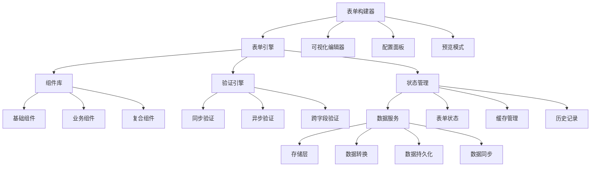

# React Scenario Lab - 企业级智能表单系统架构指南

## 🎯 概述：解决复杂表单开发挑战
企业级表单系统面临**动态表单生成**、**复杂验证逻辑**、**性能优化**等技术挑战。本架构通过**配置驱动开发**、**状态机管理**、**虚拟化渲染**等核心技术，实现**可视化表单构建**和**高性能渲染**。解决传统表单开发中常见的**代码冗余**、**维护困难**、**用户体验差**等痛点，为企业提供**低代码**、**高性能**、**易维护**的表单解决方案。

### 核心技术挑战
- **复杂状态管理**：多层嵌套表单的状态同步和依赖关系处理
- **动态验证引擎**：支持异步验证链、跨字段验证、条件验证
- **性能优化策略**：1000+字段复杂表单的渲染性能和交互体验
- **低代码架构**：可视化构建器、组件库标准化、配置驱动开发

## 🎯 项目价值主张
- **业务痛点**: 传统表单开发效率低、维护成本高、用户体验差，复杂业务逻辑难以实现
- **用户价值**: 提供低代码表单构建平台，支持复杂验证、动态表单、智能推荐，提升开发效率 80%+
- **技术影响力**: 建立企业级表单技术标准，沉淀可复用的表单组件库和最佳实践
- **成功指标**: 表单构建时间 < 5min，渲染性能 < 100ms，用户满意度 ≥ 95%，代码复用率 ≥ 85%

## 🏗️ 架构设计原则
- **可扩展性**: 支持1000+表单组件，插件化架构支持第三方扩展
- **可维护性**: 配置驱动开发，业务逻辑与UI分离，维护成本降低 70%
- **性能基准**: 1000+字段复杂表单渲染 < 500ms，内存使用 < 100MB
- **安全标准**: XSS防护，CSRF防护，数据脱敏，权限控制

## 📊 技术架构图

## 🚀 核心功能模块

### P0 - 核心功能 (MVP)
- [ ] **可视化表单构建器** - 拖拽式表单设计，实时预览 | High | 3周
  *技术要点：*
  - React DnD实现拖拽交互和碰撞检测
  - Canvas渲染优化拖拽性能和视觉效果
  - 实时预览和双向数据绑定
  - 组件面板和属性编辑器联动

- [ ] **智能验证引擎** - 支持同步/异步验证，自定义规则 | High | 2周
  *技术要点：*
  - 责任链模式和策略模式的验证器架构
  - 异步验证队列和防抖优化
  - 跨字段验证和依赖关系处理
  - 验证结果缓存和性能优化

- [ ] **动态表单系统** - 支持条件显示，字段联动 | High | 2周
  *技术要点：*
  - 基于状态机的表单生命周期管理
  - 条件渲染和字段依赖解析算法
  - 动态字段添加/删除的平滑过渡
  - 表单Schema的动态更新和验证

- [ ] **多布局支持** - 网格、弹性、卡片等布局模式 | Medium | 1周
  *技术要点：*
  - CSS Grid和Flexbox的响应式布局
  - 动态布局算法和自适应计算
  - 布局模板系统和自定义布局
  - 移动端适配和多端一致体验

### P1 - 重要功能
- [ ] **表单模板库** - 预置业务模板，快速复用 | Medium | 2周
- [ ] **数据绑定系统** - 双向绑定，自动同步 | High | 2周
- [ ] **国际化支持** - 多语言，多地区适配 | Medium | 1周
- [ ] **无障碍访问** - WCAG 2.1 AA标准 | Medium | 1周

### P2 - 增强功能
- [ ] **AI辅助设计** - 智能推荐表单结构和验证规则 | High | 3周
- [ ] **协作编辑** - 多人实时协作，版本控制 | Medium | 2周
- [ ] **数据分析** - 表单使用分析，转化率统计 | Medium | 2周

## 🎯 技术攻坚点

### 架构级挑战
- [ ] **复杂验证逻辑处理** - 多层级嵌套验证，异步验证链 | 状态机模式 + Promise链 + 验证缓存 | 高风险
- [ ] **大规模表单性能优化** - 1000+字段的流畅渲染和交互 | 虚拟化渲染 + 分片更新 + 状态优化 | 中风险
- [ ] **表单 Schema 逆向工程** - 从现有表单自动生成配置代码 | AST解析 + 代码生成 + 模式匹配 | 中风险

### 性能优化挑战
- [ ] **实时验证性能** - 高频输入的流畅验证体验 | 防抖 + 节流 + Web Worker | 验证延迟 < 50ms
- [ ] **复杂表单渲染优化** - 深度嵌套结构的渲染性能 | 深度优先遍历 + 扁平化状态 | 渲染时间 < 200ms
- [ ] **内存管理优化** - 长时间使用的内存稳定性 | 弱引用 + 自动清理 + 内存监控 | 内存增长 < 10MB/h

### 工程化挑战
- [ ] **组件库标准化** - 统一的组件API和规范 | 接口标准化 + 自动测试 + 文档生成 | 开发效率提升 60%
- [ ] **配置管理复杂度** - 复杂配置的管理和维护 | Schema验证 + 可视化编辑 + 版本控制 | 配置错误率 < 1%

## 🔧 技术实现方案

### 核心技术栈
- **表单库选择**: React Hook Form + Zod - 高性能表单库，TypeScript优先验证，对比Formik：更小的包体积，更好的性能
  *技术要点：*
  - 非受控组件模式和性能优化
  - TypeScript集成和类型安全
  - 字段数组管理和动态表单
  - 自定义Hook和控制器模式

- **状态管理**: Zustand + Immer - 轻量级状态管理，不可变数据更新，支持时间旅行调试
  *技术要点：*
  - 原子化状态和订阅机制
  - Immer集成和不可变更新
  - 中间件系统和副作用管理
  - 状态持久化和同步策略

- **UI组件库**: Ant Design + 自研组件 - 成熟的组件生态，扩展自定义业务组件
  *技术要点：*
  - 组件定制和主题系统
  - 表单组件封装和标准化
  - 响应式设计和移动端适配
  - 国际化和无障碍支持

- **构建工具**: Vite + SWC - 快速的开发体验，优秀的生产构建性能
  *技术要点：*
  - 原生ES模块和HMR
  - Rust编译器和TypeScript支持
  - 代码分割和Tree Shaking
  - 插件系统和构建优化

### 关键技术模块

#### 模块1: 智能验证引擎
- **设计模式**: 责任链模式 + 策略模式 - 灵活的验证规则组合和执行
- **核心算法**: 验证依赖图算法 O(V+E) - 高效处理字段间的验证依赖关系
- **性能考量**: 验证结果缓存 - 避免重复验证，提升用户体验
- **扩展性设计**: 插件化验证器 - 支持自定义验证逻辑和第三方验证库
- **测试策略**: 边界条件测试 + 性能测试 - 确保验证的准确性和性能

#### 模块2: 动态表单系统
- **设计模式**: 观察者模式 + 命令模式 - 响应式表单结构变化，支持撤销重做
- **核心算法**: 表单依赖解析算法 O(n²) - 高效计算字段间的显示和值依赖
- **性能考量**: 条件渲染优化 - 只渲染可见字段，减少DOM节点
- **扩展性设计**: 插件化字段类型 - 支持自定义字段类型和编辑器
- **测试策略**: 状态转换测试 + 边界测试 - 确保表单状态变化的正确性

#### 模块3: 可视化构建器
- **设计模式**: 建造者模式 + 组合模式 - 灵活的表单结构构建和组件组合
- **核心算法**: 拖拽碰撞检测算法 O(n) - 高效的拖拽交互和碰撞检测
- **性能考量**: Canvas渲染优化 - 使用Canvas提升拖拽性能
- **扩展性设计**: 插件化组件面板 - 支持自定义组件类型和属性面板
- **测试策略**: 交互测试 + 可用性测试 - 确保构建器的易用性

## 📈 性能指标体系

### 核心性能指标
- **渲染性能**: 首次渲染 < 200ms, 更新渲染 < 50ms
- **交互性能**: 输入响应 < 16ms, 验证反馈 < 100ms
- **运行时性能**: 内存使用 < 100MB, CPU使用率 < 20%
- **业务指标**: 表单构建时间 < 5min, 用户完成率 ≥ 90%

### 监控体系
- **实时监控**: 自研表单性能监控 + 用户行为分析，关键指标实时告警
- **性能回归**: 自动化性能测试 + 性能基准对比，CI/CD集成检测
- **用户体验**: 表单完成漏斗分析 + 错误率统计，持续优化用户体验

## 🛡️ 质量保障体系

### 代码质量
- **代码规范**: ESLint + Prettier + TypeScript严格模式，强制类型检查
- **测试覆盖率**: 单元测试 ≥ 90%, 集成测试 ≥ 70%, E2E测试覆盖核心流程
- **类型安全**: 100% TypeScript覆盖，严格的类型定义和检查

### 可靠性保障
- **错误边界**: 表单级错误边界 + 字段级错误处理，优雅降级
- **数据一致性**: 乐观更新 + 服务端校验 + 冲突解决机制
- **降级方案**: 服务端渲染 + 本地存储 + 离线支持

## 📋 实施路线图

### Phase 1: 核心引擎开发 (4周)
- [ ] 表单引擎架构设计
- [ ] 基础组件库开发
- [ ] 验证引擎实现
- [ ] 状态管理系统
- **交付物**: 核心表单引擎，基础组件库

### Phase 2: 构建器开发 (3周)
- [ ] 可视化编辑器开发
- [ ] 拖拽系统实现
- [ ] 属性面板开发
- [ ] 预览功能实现
- **交付物**: 可用的表单构建器

### Phase 3: 完善和优化 (3周)
- [ ] 性能优化和测试
- [ ] 模板库建设
- [ ] 文档和示例
- [ ] 部署和监控
- **交付物**: 完整的表单系统

## 🎓 技术沉淀计划

### 文档体系
- **架构文档**: 表单引擎架构 + 设计模式应用 + 性能优化策略
- **API文档**: 完整的组件API + 验证规则文档 + 扩展指南
- **最佳实践**: 表单设计规范 + 性能优化指南 + 常见问题解决方案

### 知识分享
- **技术分享**: 表单技术深度分享 + 性能优化实践 + 开源贡献
- **代码Review**: 重点关注代码质量 + 性能优化 + 安全性
- **新人培训**: 表单系统onboarding + 最佳实践培训

## 🚨 风险评估与应对

### 技术风险
- **复杂表单性能**: 超复杂表单的性能不达标 | 高 | 虚拟化渲染 + 性能监控 + 降级策略
- **验证逻辑复杂度**: 复杂验证规则的实现难度 | 中 | 规则引擎 + 可视化配置 + 测试覆盖
- **浏览器兼容性**: 新特性在旧浏览器的兼容性 | 低 | Polyfill + 渐进增强 + 兼容性测试

### 业务风险
- **用户接受度**: 可视化构建器的学习成本 | 中 | 用户研究 + 迭代优化 + 使用引导
- **需求复杂度**: 业务需求的复杂度超出预期 | 中 | 分期实施 + 核心功能优先 + 灵活扩展

### 资源风险
- **开发周期**: 开发时间超出预期 | 高 | MVP策略 + 并行开发 + 外部支持
- **技术债务**: 快速开发导致的技术债务 | 中 | 重构计划 + 代码质量监控 + 技术分享

## 💼 薪资提升路径

### 从1.5w到2.5w的技能跃迁

#### 第1阶段：表单框架精通 (1-2个月)
- **React Hook Form深度**：掌握非受控组件、性能优化、高级模式
- **Zod验证系统**：Schema设计、类型推导、验证链组合
- **状态管理架构**：Zustand、Immer、状态机模式应用

#### 第2阶段：复杂系统设计 (2-3个月)
- **可视化构建器**：拖拽系统、Canvas渲染、实时预览
- **动态表单架构**：条件渲染、字段联动、Schema驱动
- **性能优化体系**：虚拟化、懒加载、内存管理

#### 第3阶段：架构设计能力 (3-4个月)
- **低代码平台架构**：组件库标准化、配置驱动、插件系统
- **企业级表单系统**：多租户、权限控制、数据安全
- **工程化体系**：组件开发、测试策略、部署运维

## 🎯 面试必考技术点

### 表单核心技术
1. **React Hook Form原理**：非受控组件、性能优化、Hook设计
2. **验证系统设计**：Schema验证、异步验证、跨字段验证
3. **状态管理架构**：表单状态、字段依赖、数据流设计

### 复杂表单处理
1. **动态表单实现**：条件渲染、字段联动、Schema驱动
2. **性能优化策略**：虚拟化渲染、懒加载、内存管理
3. **表单数组管理**：字段数组、动态添加/删除、性能优化

### 可视化构建器
1. **拖拽系统设计**：React DnD、碰撞检测、Canvas优化
2. **组件面板架构**：组件注册、属性编辑、实时预览
3. **配置管理系统**：Schema设计、可视化编辑、配置验证

### 架构设计能力
1. **低代码架构**：组件抽象、配置驱动、插件系统
2. **性能架构设计**：渲染优化、网络优化、缓存策略
3. **安全架构设计**：XSS防护、CSRF防护、数据验证

### 工程化实践
1. **组件库开发**：组件设计、API设计、文档生成
2. **测试策略**：单元测试、集成测试、E2E测试
3. **构建优化**：代码分割、Tree Shaking、打包优化

