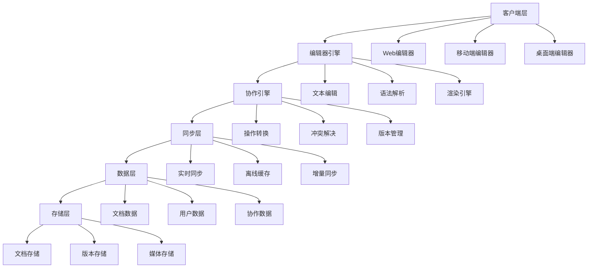

# React Scenario Lab - 企业级协同Markdown编辑平台架构指南

## 🎯 概述：解决协同编辑核心技术挑战
企业级协同编辑面临**实时数据同步**、**冲突解决算法**、**大文件性能优化**等技术挑战。本架构通过**分布式状态管理**、**CRDT算法**、**虚拟化渲染**等核心技术，实现**毫秒级编辑响应**和**零冲突协作体验**。解决传统文档工具中常见的**数据丢失**、**版本冲突**、**性能卡顿**等痛点，为企业打造媲美Notion的高效协作平台。

### 核心技术挑战
- **分布式一致性**：多客户端并发编辑的状态同步和一致性保证
- **冲突解决算法**：复杂编辑操作的自动冲突检测和智能合并
- **实时性能优化**：大文档(10MB+)的流畅编辑和实时协作
- **跨端同步**：Web、移动端、桌面端的无缝数据同步和体验一致性

## 🎯 项目价值主张
- **业务痛点**: 传统文档编辑工具缺乏实时协作、版本管理、多端同步能力，影响团队协作效率
- **用户价值**: 提供类似Notion的文档协作平台，支持实时编辑、智能格式化、团队知识管理，提升文档创作效率 70%+
- **技术影响力**: 建立企业级富文本编辑技术标准，沉淀可复用的编辑器组件和协作算法
- **成功指标**: 编辑响应时间 < 50ms，同步延迟 < 200ms，用户满意度 ≥ 95%，系统可用性 ≥ 99.9%

## 🏗️ 架构设计原则
- **实时协作**: 支持百人级同时编辑，冲突解决准确率 ≥ 99%
- **跨平台兼容**: Web、移动端、桌面端一致体验
- **高性能**: 支持10MB+大文件编辑，内存使用 < 200MB
- **可扩展性**: 插件化架构，支持自定义语法和渲染规则

## 📊 技术架构图

## 🚀 核心功能模块

### P0 - 核心功能 (MVP)
- [ ] **高性能编辑器** - Monaco Editor集成，支持语法高亮和智能提示 | High | 3周
  *技术要点：*
  - Monaco Editor API深度定制和性能优化
  - Worker线程中的语法解析和语法树构建
  - 增量渲染和虚拟滚动技术
  - 自定义语言服务和智能提示引擎

- [ ] **实时协作引擎** - OT算法实现，支持多人同时编辑 | High | 4周
  *技术要点：*
  - Operational Transformation算法实现和优化
  - WebSocket长连接和心跳保活机制
  - 向量时钟和因果关系追踪
  - 冲突检测和自动合并算法

- [ ] **Markdown渲染** - 扩展语法支持，自定义主题 | Medium | 2周
  *技术要点：*
  - 自定义语法解析器和AST构建
  - 插件化渲染器和组件系统
  - 数学公式、图表、代码块等扩展语法
  - 实时预览和双向绑定机制

- [ ] **文档管理** - 文档CRUD，文件夹组织 | Medium | 1周
  *技术要点：*
  - 基于树形结构的文档组织算法
  - 文档权限和访问控制
  - 全文搜索和智能推荐
  - 批量操作和导入导出功能

### P1 - 重要功能
- [ ] **版本控制系统** - Git-like版本管理，分支合并 | High | 3周
- [ ] **插件系统** - 自定义语法扩展，第三方插件 | Medium | 2周
- [ ] **智能格式化** - AI辅助排版，自动格式优化 | Medium | 2周
- [ ] **多端同步** - 跨设备实时同步，离线支持 | High | 3周

### P2 - 增强功能
- [ ] **AI写作助手** - 内容生成，语法检查，智能建议 | High | 4周
- [ ] **知识图谱** - 文档关联，智能推荐，知识发现 | Medium | 3周
- [ ] **团队协作** - 评论系统，任务分配，团队工作流 | Medium | 2周

## 🎯 技术攻坚点

### 架构级挑战
- [ ] **实时协作算法** - 分布式编辑状态同步和冲突解决 | Operational Transformation + CRDT + 向量时钟 | 高风险
- [ ] **大文件编辑性能** - 10MB+文档的流畅编辑体验 | 虚拟化渲染 + 增量解析 + 懒加载 | 中风险
- [ ] **多端状态同步** - 跨设备的一致性保证 | 状态同步协议 + 冲突检测 + 自动合并 | 中风险

### 编辑器性能挑战
- [ ] **语法解析性能** - 复杂文档的实时语法高亮 | 增量解析 + 语法树缓存 + Web Worker | 解析延迟 < 100ms
- [ ] **渲染性能优化** - 大量内容的流畅渲染 | 虚拟滚动 + 分片渲染 + 硬件加速 | 渲染帧率 ≥ 60fps
- [ ] **内存管理优化** - 长时间编辑的内存稳定性 | 内存池 + 垃圾回收优化 + 泄漏检测 | 内存增长 < 10MB/h

### 协作算法挑战
- [ ] **操作转换算法** - 复杂编辑操作的正确转换 | OT算法优化 + 测试覆盖 + 边界处理 | 冲突解决准确率 ≥ 99%
- [ ] **网络异常处理** - 断网重连和数据一致性 | 心跳检测 + 自动重连 + 本地缓存 | 故障恢复时间 < 30s
- [ ] **权限控制** - 细粒度的文档权限管理 | RBAC + 实时权限同步 + 安全审计 | 权限响应时间 < 100ms

## 🔧 技术实现方案

### 核心技术栈
- **编辑器**: Monaco Editor - VS Code内核，强大的代码编辑能力，对比CodeMirror：更丰富的功能，更好的性能
  *技术要点：*
  - TypeScript支持和智能提示系统
  - 多光标编辑和代码格式化
  - 主题定制和语法高亮引擎
  - 扩展系统和插件API

- **协作引擎**: 自研OT引擎 + Yjs - 定制化的协作算法 + 成熟的CRDT库，确保数据一致性
  *技术要点：*
  - Operational Transformation算法实现
  - Conflict-free Replicated Data Types (CRDT)
  - 向量时钟和版本向量算法
  - 分布式状态同步和一致性保证

- **状态管理**: Redux Toolkit + RTK Query - 可预测的状态管理 + 数据缓存和同步
  *技术要点：*
  - 不可变数据更新和状态回滚
  - 中间件系统和副作用管理
  - 数据缓存和同步策略
  - 开发工具集成和调试支持

- **实时通信**: Socket.IO + WebRTC - 可靠的实时通信 + P2P直连优化
  *技术要点：*
  - WebSocket长连接和心跳机制
  - 房间管理和广播策略
  - 断线重连和离线同步
  - P2P数据传输和性能优化

### 关键技术模块

#### 模块1: 协作编辑引擎
- **设计模式**: 命令模式 + 观察者模式 - 编辑操作的封装和广播，状态变化的响应
- **核心算法**: Operational Transformation算法 O(n²) - 分布式编辑操作的转换和合并
- **性能考量**: 操作合并 - 连续操作的合并，减少网络传输和计算
- **扩展性设计**: 插件化操作 - 支持自定义编辑操作和转换规则
- **测试策略**: 并发测试 + 冲突测试 - 验证多用户协作场景的稳定性

#### 模块2: 高性能渲染引擎
- **设计模式**: 策略模式 + 虚拟模式 - 灵活的渲染策略，大文件的虚拟化渲染
- **核心算法**: 增量渲染算法 O(n) - 只重新渲染变化的部分，提升性能
- **性能考量**: 硬件加速 - 使用GPU加速渲染，提升大文档的显示性能
- **扩展性设计**: 渲染器插件 - 支持自定义语法和渲染规则
- **测试策略**: 性能测试 + 压力测试 - 确保大文件编辑的流畅性

#### 模块3: 版本控制系统
- **设计模式**: 命令模式 + 备忘录模式 - 编辑操作的记录和恢复，版本状态的管理
- **核心算法**: 差分算法 O(n) - 高效计算版本间的差异，支持快速合并
- **性能考量**: 增量存储 - 只存储变化的部分，减少存储空间
- **扩展性设计**: 分支策略 - 支持多分支开发和工作流
- **测试策略**: 数据完整性测试 + 并发操作测试 - 确保版本管理的可靠性

## 📈 性能指标体系

### 核心性能指标
- **编辑性能**: 输入响应 < 16ms, 语法高亮 < 100ms, 自动保存 < 500ms
- **协作性能**: 操作同步延迟 < 200ms, 冲突解决 < 50ms, 状态一致性 99.9%
- **渲染性能**: 文档打开 < 2s, 滚动渲染 ≥ 60fps, 内存使用 < 200MB
- **业务指标**: 文档创建时间 < 30s, 协作效率提升 70%, 用户满意度 ≥ 95%

### 监控体系
- **实时监控**: 编辑器性能监控 + 协作状态监控，异常自动告警
- **性能回归**: 自动化性能测试 + 基线对比，CI/CD集成检测
- **用户体验**: 用户行为分析 + 编辑效率统计，持续优化体验

## 🛡️ 质量保障体系

### 代码质量
- **代码规范**: TypeScript严格模式 + ESLint规则，100%类型覆盖
- **测试覆盖**: 单元测试 ≥ 90%, 集成测试 ≥ 70%, E2E测试覆盖核心协作流程
- **代码审查**: 重点审查协作算法、性能优化、安全性

### 可靠性保障
- **数据一致性**: 多重校验 + 冲突检测 + 自动恢复机制
- **容错机制**: 优雅降级 + 离线支持 + 错误恢复
- **安全防护**: XSS防护 + CSRF防护 + 权限控制

## 📋 实施路线图

### Phase 1: 基础编辑器 (4周)
- [ ] Monaco Editor集成和定制
- [ ] Markdown语法解析和渲染
- [ ] 基础编辑功能实现
- [ ] 文档管理系统
- **交付物**: 功能完整的单用户编辑器

### Phase 2: 协作系统 (5周)
- [ ] 实时协作引擎开发
- [ ] 操作转换算法实现
- [ ] 冲突解决机制
- [ ] 多用户状态同步
- **交付物**: 支持多人协作的编辑器

### Phase 3: 高级功能 (4周)
- [ ] 版本控制系统
- [ ] 插件系统架构
- [ ] 多端同步机制
- [ ] 性能优化和测试
- **交付物**: 完整的企业级协作平台

## 🎓 技术沉淀计划

### 文档体系
- **协作算法文档**: OT算法详解、冲突解决策略、性能优化方案
- **编辑器架构文档**: 组件设计、插件开发、性能调优
- **最佳实践**: 协作编辑设计模式、性能优化技巧、安全防护策略

### 知识分享
- **技术分享**: 协作算法原理、编辑器性能优化、分布式系统设计
- **开源贡献**: 协作编辑库、编辑器组件、性能工具
- **培训体系**: 协作编辑培训、插件开发培训、性能优化培训

## 🚨 风险评估与应对

### 技术风险
- **协作算法复杂性**: OT算法实现和调试复杂度高 | 高 | 充分测试 + 渐进实现 + 专家咨询
- **性能瓶颈**: 大文档和多用户协作的性能问题 | 中 | 性能监控 + 优化预案 + 降级策略
- **数据一致性**: 分布式环境下的数据一致性保证 | 高 | 严格测试 + 冗余校验 + 快速恢复

### 业务风险
- **用户接受度**: 新的协作模式的学习成本 | 中 | 用户培训 + 渐进迁移 + 界面优化
- **竞品压力**: Notion等成熟产品的竞争压力 | 低 | 差异化功能 + 技术优势 + 用户体验

### 资源风险
- **技术人才**: 协作算法专家稀缺 | 中 | 技术培训 + 外部合作 + 知识沉淀
- **开发周期**: 复杂功能开发周期长 | 高 | MVP策略 + 并行开发 + 敏捷迭代

## 💼 薪资提升路径

#### 第1阶段：编辑器深度掌握 (1-2个月)
- **Monaco Editor精通**：深入理解编辑器架构、扩展系统、性能优化
- **Web Workers实战**：掌握多线程开发、消息传递、性能隔离
- **语法解析技术**：AST构建、语法分析器、自定义语言服务

#### 第2阶段：分布式算法实践 (2-3个月)
- **OT/CRDT算法**：理解并实现Operational Transformation和CRDT
- **实时通信架构**：WebSocket、WebRTC、分布式状态同步
- **冲突解决机制**：向量时钟、因果一致性、自动合并算法

#### 第3阶段：架构设计能力 (3-4个月)
- **协同系统架构**：设计支持千人级并发的协同编辑系统
- **跨端同步方案**：Web、移动端、桌面端的数据同步架构
- **性能优化体系**：大文件编辑、实时协作的性能优化策略

## 🎯 面试必考技术点

### 编辑器核心技术
1. **Monaco Editor架构**：编辑器模型、视图控制器、语言服务
2. **语法高亮引擎**：Tokenization、TextMate语法、主题系统
3. **智能提示系统**：Language Server Protocol、自动完成、代码导航

### 分布式协作算法
1. **Operational Transformation**：操作转换原理、算法实现、边界条件
2. **CRDT数据结构**：G-Counter、PN-Counter、OR-Set、LWW-Element-Set
3. **一致性模型**：强一致性、最终一致性、因果一致性

### 实时通信技术
1. **WebSocket深度应用**：连接管理、心跳保活、断线重连
2. **WebRTC实战**：P2P连接、数据通道、媒体流传输
3. **分布式状态管理**：状态同步、冲突检测、自动合并

### 性能优化策略
1. **大文件编辑优化**：虚拟滚动、增量渲染、内存管理
2. **实时协作性能**：批量操作、节流防抖、网络优化
3. **跨端性能**：响应式设计、适配策略、性能监控

### 系统架构设计
1. **协同编辑架构**：C/S架构、P2P架构、混合架构
2. **版本控制系统**：Git-like版本管理、分支合并、冲突解决
3. **权限和安全**：RBAC权限模型、数据加密、安全审计

