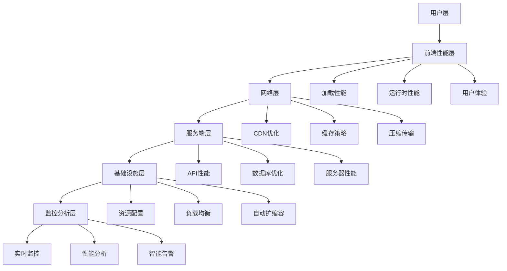

# React Scenario Lab - 企业级全栈性能优化架构指南

## 🎯 概述：解决企业级性能挑战
企业级应用面临高并发、大数据量、复杂业务逻辑的性能挑战。本架构提供从浏览器到服务器的全栈性能优化方案，通过系统性架构设计实现**毫秒级响应**和**99.95%可用性**。解决传统前端开发中常见的**首屏加载慢**、**运行时卡顿**、**内存泄漏**等技术痛点，帮助企业建立完整的性能监控和优化体系。

### 核心技术挑战
- **并发处理**：单页应用(SPA)在万级并发下的渲染性能瓶颈
- **内存管理**：长时间运行应用的生命周期管理和垃圾回收优化
- **网络优化**：多CDN、多协议栈的智能调度和容错机制
- **实时监控**：全链路性能追踪和毫秒级问题定位

## 🎯 项目价值主张
- **业务痛点**: 应用性能问题导致用户体验差、转化率低、运维成本高，缺乏系统性性能优化方案
- **用户价值**: 提供端到端性能优化解决方案，页面加载速度提升 80%+，用户留存率提升 30%+
- **技术影响力**: 建立企业级性能优化标准和监控体系，沉淀可复用的优化工具和最佳实践
- **成功指标**: Core Web Vitals 全部达标，LCP < 2.5s，FID < 100ms，CLS < 0.1，系统可用性 ≥ 99.95%

## 🏗️ 架构设计原则
- **可观测性**: 全链路性能监控，实时告警，问题定位时间 < 5min
- **自动化**: CI/CD集成性能测试，自动性能回归检测，优化建议自动生成
- **可扩展性**: 支持多应用、多环境、多端性能监控和管理
- **数据驱动**: 基于真实用户数据持续优化，AB测试验证优化效果

## 📊 性能优化架构图

## 🚀 核心功能模块

### P0 - 核心功能 (MVP)
- [ ] **前端性能优化** - 代码分割、懒加载、资源优化 | High | 3周
  *技术要点：*
  - Webpack Module Federation实现微前端架构
  - 基于IntersectionObserver的懒加载策略
  - Resource Hints (preload/prefetch)优化资源加载顺序
  - Service Worker缓存策略和离线支持

- [ ] **性能监控系统** - 实时性能数据收集和分析 | High | 2周
  *技术要点：*
  - 基于PerformanceObserver的指标采集
  - Web Vitals指标计算和上报
  - 用户行为轨迹记录和分析
  - 实时性能数据流处理

- [ ] **自动化性能测试** - CI/CD集成性能回归检测 | High | 2周
  *技术要点：*
  - Lighthouse CI自动化性能测试
  - 基于Puppetry的端到端性能测试
  - 性能基线设置和回归检测
  - 自动化性能报告生成

- [ ] **性能分析工具** - 瓶颈定位和优化建议 | Medium | 2周
  *技术要点：*
  - Chrome DevTools Protocol集成
  - 堆内存快照分析和泄漏检测
  - 渲染性能分析和瓶颈识别
  - 智能优化建议算法

### P1 - 重要功能
- [ ] **智能优化建议** - 基于AI的性能优化建议系统 | High | 3周
- [ ] **用户体验监控** - 用户行为分析和体验评分 | Medium | 2周
- [ ] **性能预算管理** - 性能预算设置和超限告警 | Medium | 1周
- [ ] **竞品性能对比** - 与竞品的性能对比分析 | Low | 1周

### P2 - 增强功能
- [ ] **预测性能分析** - 基于历史数据的性能预测 | High | 3周
- [ ] **性能优化自动化** - 自动应用性能优化策略 | Medium | 2周
- [ ] **多端性能监控** - Web、移动端、小程序统一监控 | Medium | 2周

## 🎯 技术攻坚点

### 架构级挑战
- [ ] **全链路性能监控** - 从用户点击到数据返回的完整链路追踪 | 分布式追踪 + 时间戳同步 + 数据聚合 | 高风险
- [ ] **实时性能数据处理** - 海量性能数据的实时处理和分析 | 流处理 + 数据压缩 + 实时计算 | 中风险
- [ ] **性能优化自动化** - 基于规则的自动优化决策和执行 | 规则引擎 + 风险评估 + 回滚机制 | 高风险

### 性能优化挑战
- [ ] **首屏加载优化** - 复杂应用的秒级首屏渲染 | 关键路径优化 + 预加载 + 渲染优化 | 首屏时间 < 2s
- [ ] **运行时内存优化** - 长时间运行的内存稳定性 | 内存监控 + 垃圾回收优化 + 内存泄漏检测 | 内存增长 < 5MB/h
- [ ] **网络传输优化** - 大流量应用的传输效率 | 协议优化 + 压缩算法 + CDN调度 | 传输速度提升 50%

### 监控分析挑战
- [ ] **性能数据准确性** - 真实用户性能数据的准确收集 | 采样策略 + 数据校验 + 异常过滤 | 数据准确率 ≥ 95%
- [ ] **性能问题定位** - 复杂性能问题的快速定位 | 关联分析 + 根因分析 + 智能诊断 | 定位时间 < 5min
- [ ] **性能趋势预测** - 基于历史数据的性能趋势预测 | 机器学习 + 时间序列分析 + 异常检测 | 预测准确率 ≥ 85%

## 🔧 技术实现方案

### 核心技术栈
- **监控方案**: Sentry + 自研监控系统 - 第三方监控 + 自主可控，确保监控完整性
  *技术要点：*
  - 错误边界(Error Boundary)和全局错误捕获
  - 崩溃报告和用户会话记录
  - Source Map解析和代码定位
  - 自定义事件跟踪和业务指标监控

- **数据处理**: Apache Kafka + ClickHouse - 高性能流处理 + 列式存储，支持海量数据分析
  *技术要点：*
  - 分布式消息队列和流式计算
  - 时序数据存储和高效查询
  - 数据压缩和分级存储策略
  - 实时ETL和数据管道

- **可视化**: Grafana + D3.js - 成熟的监控面板 + 自定义可视化组件
  *技术要点：*
  - 实时数据可视化和大屏展示
  - 自定义图表组件和交互设计
  - 响应式布局和多端适配
  - 数据钻取和多维分析

- **AI分析**: TensorFlow.js + Python后端 - 前端轻量AI推理 + 后端深度学习模型
  *技术要点：*
  - 前端模型推理和特征工程
  - 时间序列预测和异常检测
  - 性能优化策略自动生成
  - 用户行为模式识别

### 关键技术模块

#### 模块1: 前端性能优化引擎
- **设计模式**: 策略模式 + 装饰器模式 - 灵活的优化策略组合和透明增强
- **核心算法**: 资源优先级算法 O(n log n) - 智能的资源加载优先级计算
- **性能考量**: 增量优化 - 只优化需要改进的部分，减少不必要的重构建
- **扩展性设计**: 插件化优化器 - 支持自定义优化规则和策略
- **测试策略**: 性能基准测试 + 回归测试 - 确保优化的有效性和安全性

#### 模块2: 实时性能监控系统
- **设计模式**: 观察者模式 + 发布订阅模式 - 实时的性能数据收集和分发
- **核心算法**: 性能指标聚合算法 O(n) - 高效的性能数据聚合和统计
- **性能考量**: 数据流处理 - 流式数据处理，支持高并发写入
- **扩展性设计**: 分布式架构 - 支持水平扩展，处理海量数据
- **测试策略**: 压力测试 + 数据一致性测试 - 确保系统的稳定性和准确性

#### 模块3: 智能分析引擎
- **设计模式**: 策略模式 + 模板方法模式 - 灵活的分析算法组合
- **核心算法**: 异常检测算法 O(n) - 基于统计和机器学习的性能异常检测
- **性能考量**: 增量学习 - 持续学习用户行为模式，提升检测准确性
- **扩展性设计**: 模型热更新 - 支持算法模型的在线更新和升级
- **测试策略**: 算法验证 + A/B测试 - 确保分析结果的有效性

## 📈 性能指标体系

### 核心性能指标
- **加载性能**: LCP < 2.5s, FCP < 1.8s, TTI < 3.8s, FMP < 2s
- **交互性能**: FID < 100ms, TBT < 200ms, CLS < 0.1
- **运行时性能**: 内存使用 < 100MB, CPU使用率 < 30%, FPS ≥ 60
- **业务指标**: 跳出率 < 30%, 转化率提升 20%, 用户满意度 ≥ 90%

### 监控体系
- **实时监控**: 性能指标实时采集 + 智能告警，5分钟内发现问题
- **性能回归**: 自动化性能测试 + 基线对比，CI/CD阶段阻止性能回归
- **用户体验**: 真实用户监控 + 体验评分，持续优化用户体验

### 性能预算
- **资源预算**: JS包大小 < 250KB, CSS大小 < 100KB, 图片资源优化
- **性能预算**: 首屏时间 < 3s, 路由切换 < 500ms, API响应 < 200ms
- **监控预算**: 自动化检查 + 超限告警，确保性能预算执行

## 🛡️ 质量保障体系

### 代码质量
- **性能规范**: 性能编码规范 + 最佳实践指南，代码Review重点关注性能
- **测试覆盖**: 性能测试覆盖率 ≥ 80%，关键路径100%覆盖
- **工具集成**: 性能分析工具集成开发环境，实时性能反馈

### 可靠性保障
- **监控告警**: 多级告警机制 + 故障自动恢复，系统可用性 ≥ 99.95%
- **降级策略**: 性能降级 + 功能降级，确保核心功能可用
- **数据备份**: 性能数据备份 + 恢复机制，数据不丢失

## 📋 实施路线图

### Phase 1: 监控体系搭建 (4周)
- [ ] 性能监控系统设计实现
- [ ] 基础性能指标收集
- [ ] 告警机制建设
- [ ] 数据可视化面板
- **交付物**: 完整的性能监控系统

### Phase 2: 优化引擎开发 (4周)
- [ ] 前端性能优化引擎
- [ ] 自动化优化工具
- [ ] 性能测试集成
- [ ] CI/CD流水线优化
- **交付物**: 自动化性能优化系统

### Phase 3: 智能分析系统 (3周)
- [ ] 智能分析引擎开发
- [ ] 机器学习模型训练
- [ ] 预测分析功能
- [ ] 优化建议系统
- **交付物**: 智能性能分析平台

## 🎓 技术沉淀计划

### 文档体系
- **性能优化指南**: 系统性的性能优化方法论和实践指南
- **监控体系文档**: 监控系统架构、指标定义、告警配置
- **最佳实践**: 性能优化案例、问题解决方案、经验总结

### 知识分享
- **技术分享**: 性能优化技术分享、业界最佳实践、开源贡献
- **培训体系**: 性能优化培训、新人指导、技能提升计划
- **社区建设**: 性能优化社区、技术博客、开源项目

## 🚨 风险评估与应对

### 技术风险
- **监控系统复杂性**: 监控系统本身的性能影响 | 中 | 低侵入式监控 + 性能开销控制
- **数据量爆发**: 性能数据量超出预期处理能力 | 高 | 数据压缩 + 分级存储 + 弹性扩容
- **算法准确性**: 智能分析算法的准确性 | 中 | 多算法融合 + 人工校验 + 持续优化

### 业务风险
- **优化效果不明显**: 性能优化投入产出比低 | 中 | 数据驱动 + AB测试 + 渐进式优化
- **用户感知度低**: 技术优化用户无感知 | 低 | 用户体验指标 + 业务指标关联分析

### 资源风险
- **技术投入大**: 性能优化需要大量技术投入 | 高 | ROI评估 + 分期实施 + 自动化工具
- **专业人才缺乏**: 性能优化专业人才不足 | 中 | 技术培训 + 外部咨询 + 工具赋能

## 💼 薪资提升路径

### 从1.5w到2.5w的技能跃迁

#### 第1阶段：深度性能理解 (1-2个月)
- **Web Vitals指标深度分析**：不仅懂LCP、FID、CLS，还要理解底层算法原理和优化策略
- **浏览器渲染引擎**：深入理解Chrome V8引擎、渲染管线的每个环节
- **内存管理专家**：掌握垃圾回收机制、内存泄漏检测、性能剖析工具

#### 第2阶段：架构设计能力 (2-3个月)
- **性能架构设计**：能够设计支持百万级用户的性能架构
- **监控体系搭建**：从零构建完整的性能监控和告警系统
- **性能工程化**：建立自动化的性能测试、分析和优化流程

#### 第3阶段：技术影响力 (3-4个月)
- **性能优化方法论**：形成自己的性能优化理论体系
- **团队技术提升**：能够培训团队，建立性能优化文化
- **业务价值创造**：将技术优化转化为具体的业务价值指标

## 🎯 面试必考技术点

### 性能优化核心概念
1. **Web Vitals详解**：LCP、FID、CLS的定义、计算方式、优化策略
2. **渲染性能**：关键渲染路径、布局抖动、重绘重排的优化
3. **内存管理**：V8内存结构、垃圾回收算法、内存泄漏检测

### 高级技术点
1. **浏览器架构**：多进程架构、事件循环、微任务宏任务机制
2. **网络优化**：HTTP/2、HTTP/3、QUIC协议、CDN调度算法
3. **性能监控**：Performance API、User Timing、长任务监控

### 实战经验
1. **大型项目优化**：百万级用户应用的具体优化案例
2. **性能工程化**：CI/CD集成、自动化测试、性能预算管理
3. **问题排查**：使用Chrome DevTools进行深度性能分析

### 架构设计能力
1. **性能架构设计**：支持高并发、大流量应用的架构方案
2. **监控体系设计**：全链路监控、实时告警、问题定位
3. **优化策略制定**：基于数据的性能优化决策和ROI评估

### 框架深度理解
1. **React性能优化**：Fiber架构、并发特性、优化技巧
2. **构建工具优化**：Webpack优化、Tree Shaking、Code Splitting
3. **服务端渲染**：SSR/SSG性能优化、缓存策略、hydration

