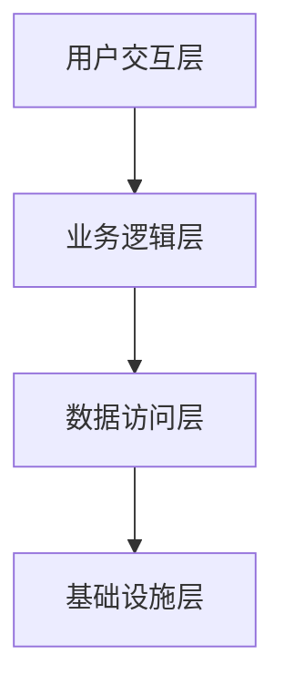

# 高级前端工程师 TODO 规划模板

## 🎯 项目价值主张
- **业务痛点**: {项目要解决的核心业务问题}
- **用户价值**: {为用户带来的核心价值}
- **技术影响力**: {对团队和技术栈的战略意义}
- **成功指标**: {可量化的成功标准}

## 🏗️ 架构设计原则
- **可扩展性**: {系统扩展能力要求}
- **可维护性**: {长期维护成本控制}
- **性能基准**: {关键性能指标要求}
- **安全标准**: {安全合规要求}

## 📊 技术架构图

## 🚀 核心功能模块

### P0 - 核心功能 (MVP)
- [ ] **{功能名称}** - {业务价值} | {技术复杂度: High/Medium/Low} | {预估工期}
- [ ] **{功能名称}** - {业务价值} | {技术复杂度: High/Medium/Low} | {预估工期}

### P1 - 重要功能
- [ ] **{功能名称}** - {业务价值} | {技术复杂度: High/Medium/Low} | {预估工期}
- [ ] **{功能名称}** - {业务价值} | {技术复杂度: High/Medium/Low} | {预估工期}

### P2 - 增强功能
- [ ] **{功能名称}** - {业务价值} | {技术复杂度: High/Medium/Low} | {预估工期}

## 🎯 技术攻坚点

### 架构级挑战
- [ ] **{挑战名称}** - {技术难点描述} | {解决方案思路} | {风险评估}
- [ ] **{挑战名称}** - {技术难点描述} | {解决方案思路} | {风险评估}

### 性能优化挑战
- [ ] **{挑战名称}** - {性能瓶颈描述} | {优化策略} | {预期提升}

### 工程化挑战
- [ ] **{挑战名称}** - {工程化难点} | {解决方案} | {收益评估}

## 🔧 技术实现方案

### 核心技术栈
- **框架选择**: {技术选型理由 + 对比分析}
- **状态管理**: {选择理由 + 架构设计}
- **样式方案**: {技术选型 + 维护性考虑}
- **构建工具**: {性能考虑 + 开发体验}

### 关键技术模块

#### 模块1: {模块名称}
- **设计模式**: {使用的设计模式}
- **核心算法**: {关键算法复杂度分析}
- **性能考量**: {时间/空间复杂度优化}
- **扩展性设计**: {接口设计和扩展点}
- **测试策略**: {单元测试 + 集成测试 + E2E}

#### 模块2: {模块名称}
- **设计模式**: {使用的设计模式}
- **核心算法**: {关键算法复杂度分析}
- **性能考量**: {时间/空间复杂度优化}
- **扩展性设计**: {接口设计和扩展点}
- **测试策略**: {单元测试 + 集成测试 + E2E}

## 📈 性能指标体系

### 核心性能指标
- **加载性能**: LCP < {时间}s, FCP < {时间}s
- **交互性能**: FID < {时间}ms, CLS < {数值}
- **运行时性能**: 内存使用 < {大小}, CPU使用率 < {百分比}
- **业务指标**: {具体的业务转化指标}

### 监控体系
- **实时监控**: {监控工具和报警机制}
- **性能回归**: {自动化检测机制}
- **用户体验**: {用户反馈收集体系}

## 🛡️ 质量保障体系

### 代码质量
- **代码规范**: {Lint规则 + 代码审查标准}
- **测试覆盖率**: {单元测试} ≥ {百分比}%, {集成测试} ≥ {百分比}%
- **类型安全**: {TypeScript严格模式配置}

### 可靠性保障
- **错误边界**: {错误处理策略}
- **降级方案**: {服务降级和容错机制}
- **数据一致性**: {数据同步和校验机制}

## 📋 实施路线图

### Phase 1: 基础架构 ({工期})
- [ ] {里程碑1}
- [ ] {里程碑2}
- **交付物**: {具体交付成果}

### Phase 2: 核心功能 ({工期})
- [ ] {里程碑1}
- [ ] {里程碑2}
- **交付物**: {具体交付成果}

### Phase 3: 优化完善 ({工期})
- [ ] {里程碑1}
- [ ] {里程碑2}
- **交付物**: {具体交付成果}

## 🎓 技术沉淀计划

### 文档体系
- **架构文档**: {技术架构和设计决策}
- **API文档**: {接口规范和使用示例}
- **最佳实践**: {编码规范和模式总结}

### 知识分享
- **技术分享**: {团队内部分享计划}
- **代码Review**: {代码质量提升机制}
- **新人培训**: {知识传承体系}

## 🚨 风险评估与应对

### 技术风险
- **风险1**: {风险描述} | {影响等级} | {应对策略}
- **风险2**: {风险描述} | {影响等级} | {应对策略}

### 业务风险
- **风险1**: {风险描述} | {影响等级} | {应对策略}
- **风险2**: {风险描述} | {影响等级} | {应对策略}

### 资源风险
- **风险1**: {风险描述} | {影响等级} | {应对策略}
- **风险2**: {风险描述} | {影响等级} | {应对策略}

