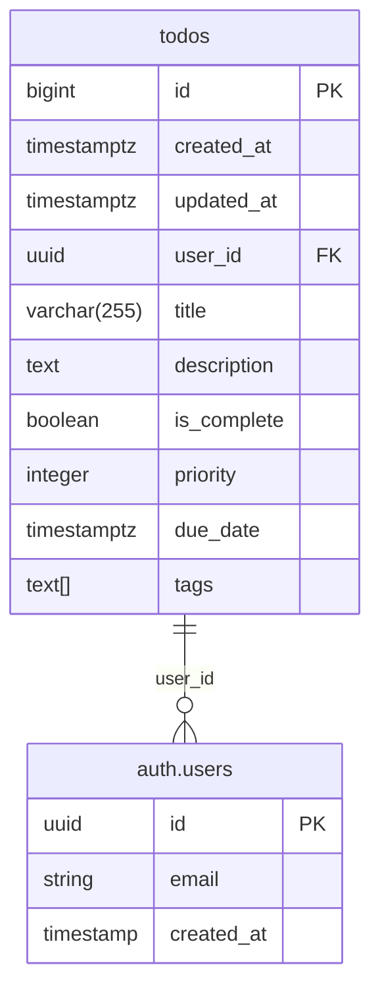

# 数据库文档

本目录包含 React Scenario Lab 项目的 Supabase 数据库设置和说明文档。

## 📁 文件说明

| 文件 | 描述 | 适用场景 |
|------|------|----------|
| [`setup.sql`](./setup.sql) | 一键设置脚本 | 新项目初始化、重置数据库 |
| [`supabase-setup.md`](./supabase-setup.md) | 详细设置指南 | 了解配置、故障排除 |
| [`typescript-fix.md`](./typescript-fix.md) | TypeScript 错误修复 | 解决类型问题、自动生成类型 |

## 🚀 快速开始

### 1. 一键设置

复制 [`setup.sql`](./setup.sql) 中的完整脚本，在 Supabase 控制台的 SQL 编辑器中执行即可。

### 2. 手动设置

参考 [`supabase-setup.md`](./supabase-setup.md) 了解详细的设置步骤和原理。

## 📋 数据库结构概览

## 🔗 相关链接

- [Supabase 控制台](https://supabase.com/dashboard)
- [项目主目录](../../)
- [组件文档](../../src/components/todos/)

## ⚠️ 重要提醒

1. **安全性**：启用了行级安全策略 (RLS)，用户只能访问自己的数据
2. **性能**：已创建必要的索引以优化查询性能
3. **备份**：在生产环境请定期备份数据库

---

如有问题，请查看详细文档或提交 Issue。