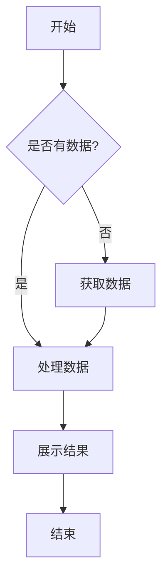
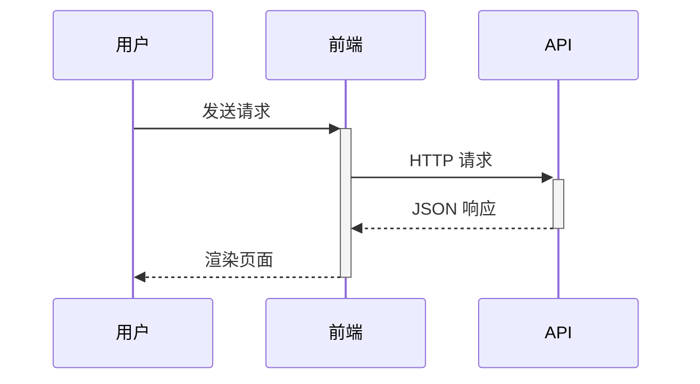
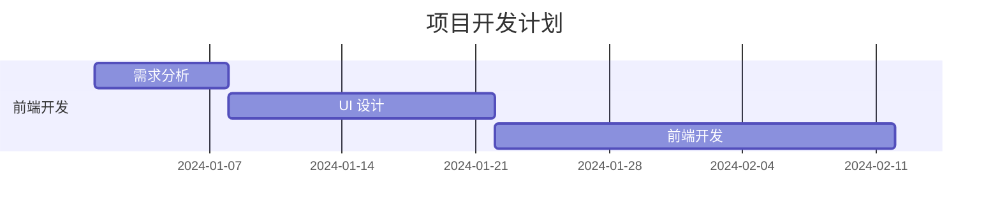

# Mermaid Chart 组件

基于 Mermaid.js 的 React 组件封装，支持各种图表类型的渲染。

## 功能特性

- 支持多种图表类型（流程图、时序图、甘特图等）
- 自定义主题和样式
- 错误处理和显示
- 语法验证
- 响应式设计

## 使用方法

```tsx
import MermaidChart from "@/components/MermaidChart";

function MyComponent() {
	const flowchartCode = `
flowchart TD
    A[开始] --> B{判断}
    B -->|是| C[执行]
    B -->|否| D[结束]
    C --> D
	`;

	return (
		<MermaidChart
			chart={flowchartCode}
			config={{
				theme: "default",
				themeVariables: {
					primaryColor: "#3b82f6",
				},
			}}
			onError={(error) => console.error("Chart error:", error)}
		/>
	);
}
```

## 支持的图表类型

- **流程图 (Flowchart)** - `flowchart TD` 或 `graph TD`
- **时序图 (Sequence)** - `sequenceDiagram`
- **甘特图 (Gantt)** - `gantt`
- **饼图 (Pie)** - `pie`
- **类图 (Class)** - `classDiagram`
- **状态图 (State)** - `stateDiagram`
- **ER 图 (Entity Relationship)** - `erDiagram`
- **用户旅程图 (User Journey)** - `journey`

## Props

| 属性 | 类型 | 默认值 | 说明 |
|------|------|--------|------|
| chart | string | - | Mermaid 图表代码 |
| config | object | {} | Mermaid 配置选项 |
| className | string | "" | CSS 类名 |
| id | string | 自动生成 | 图表唯一标识 |
| onError | (error: Error) => void | - | 错误处理回调 |

## 配置选项

### 主题
- `default` - 默认主题
- `base` - 基础主题
- `dark` - 暗色主题
- `forest` - 森林主题
- `neutral` - 中性主题

### 主题变量
```tsx
config={{
	themeVariables: {
		primaryColor: "#3b82f6",
		primaryTextColor: "#1f2937",
		primaryBorderColor: "#2563eb",
		lineColor: "#6b7280",
		sectionBkgColor: "#f9fafb",
	},
}}
```

## 示例代码

### 流程图


### 时序图


### 甘特图
